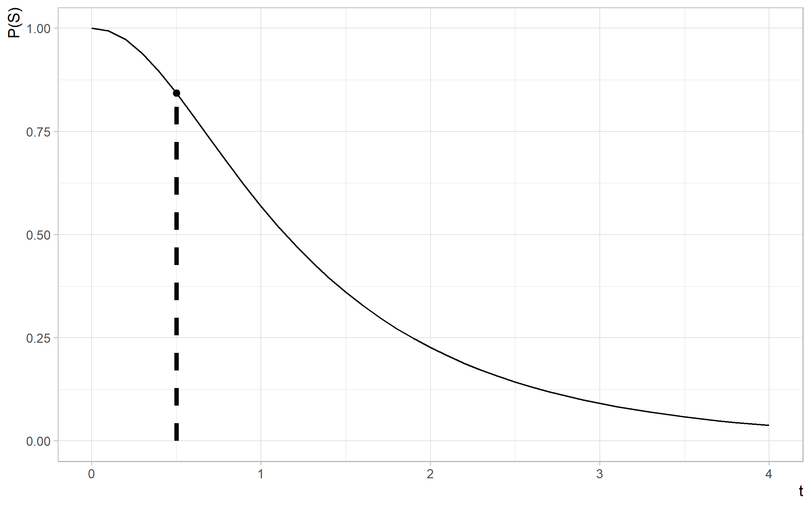

```{r setup, include=F, cache=F}
knitr::opts_knit$set(root.dir = here::here())
knitr::opts_chunk$set(
  # rows.print = 25,
  # rows.print = 25,
  echo = TRUE,
  # cache = FALSE,
  cache = TRUE,
  include = TRUE,
  fig.show = "asis",
  fig.align = "center",
  fig.width = 8,
  # size = "small",
  fig.height = 5,
  # fig.width = 5,
  # out.width = 5,
  # fig.asp = 0.75,
  warning = FALSE,
  message = FALSE
)
```

```{r postprocess, include=F, echo=F, cache=F}
.path_sans_ext <- file.path('hws', 'hw01', 'hw01')
.path_rmd <- paste0(.path_sans_ext, '.Rmd')
# spelling::spell_check_files(.path_rmd)
```

```{r setup-1, include=F, echo=F, eval=T}
library(tidyverse)
format_num <- function(x, digits = 3) {
  fmt <- sprintf("%%.%df", digits)
  sprintf(fmt, x)
}
```

# 1. Circuit

## Instructions


<instructions>
Figure 1: Components $E_1,\dots E_4$ at operational at time $t$ with probabilities $e^{−t}, e^{−2t}, e^{−t/2}, e^{−t/3}$ and $e^{−t}$, respectively.<br/><br/>
The system $S$ consists of five independent elements $E_i$, $i = 1, \dots , E_5$, connected as in Figure 1. Probability that the element $E_i$ is operational at the end of time interval $[0,t]$ is given as
</instructions>

$$
\begin{array}{cc}
p_i(t) = e^{-\lambda_i t}, & t \geq 0,
\end{array}
$$

<instructions>
for $\lambda_1 = 1, \lambda_2 = 2, \lambda_3 = 1/2, \lambda_4 = 1/3, \lambda_5 = 1$.<br/>
(a) Find the probability that the system $S$ will be operational at time $t$. Plot this probability as a function of time $t$. What is this probability for $t = 1/2$?<br/>
(b) Find the probability that component $E_5$ was operational at time $t = 1/2$, if the system was operational at that time.<br/><br/>
Hint: If you consider (b), it is conditional probability, more precisely, a posterior probability of the hypothesis $H_1: E_5$ operational at time $t$, given that system S is operational at t. Thus, solve part (a) as a total probability with $H1$ and $H_2 = H_1^C$ as hypotheses. Under the two hypotheses the system simplifies as in Figure 2 and it is easy to find $P(S|H_1)$ and $P(S|H_2)$.
Then (b) is just a Bayes formula.
The results for arbitrary t will be messy - do not simplify.
For plotting in part (a) take some reasonable interval for time $t$, say $[0, 4]$.
</instructions>


<instructions>
Figure 2: Left: System under hypothesis $H_1 : E_5$ operational; Right: System under hypothesis $H_2 : E_5$ not operational.
</instructions>

## Response

<hide>
Reference(s):
+ Exercises35: Cross-linked System
+ 2018f-hw01-q1
+ 2019s-hw01-q1
</hide>


### (a)

<hide>
Reference(s):
+ 2018f-hw01-q1: Circuit
+ 2019s-hw01-q1-a: Circuit
</hide>

We first formulate $P(S|H_1)$ (using the notation of the hint) as follows.

$$
\begin{array}{lcl}
P(S|H_1) & = & 1 - P((E_1 \cup E_3)') \\
 & = & 1 - P(E_1' \cap E_3') \\
& = & 1 - (1 - P(E_1)) (1 - P(E_3)) \\
& = & 1 - (1 - e^{-t}) (1 - e^{-t/2}) \\
& = & 1 - (1 - e^{-t} - e^{-t/2} + e^{t^2/2}) \\
& = & e^{-t} + e^{-t/2} - e^{-3t/2}.
\end{array}
$$

Note that $P((E_1 \cup E_3)'$ represents the probability that neither $E_1$ nor $E_3$ works,
which can also be expressed as $P(E_1' \cap E_3')$, which, in words, represents
the probability that both $E_1$ and $E_3$ fail. (This is just a consequence of
[De Morgan's laws](https://en.wikipedia.org/wiki/De_Morgan%27s_laws).)

Also, note that we achieved the same result more directly using the 
[addition law of probability](https://en.wikipedia.org/wiki/Probability_axioms#Further_consequences), which corresponds to the expression
$P(S|H_1) = P(E_1) + P(E_3) - P(E_1 \cap E_3)$ here.

```{r hw01-q01-a-1, include=F, echo=F, eval=T}
t_x_hide <- 0.5
f_sh1_1 <- function(t) {
  1 - (1 - exp(-t)) * (1 - exp(-t / 2))
}

f_sh1_2 <- function(t) {
  exp(-t) + exp(-t / 2) - exp(-3 * t / 2)
}
f_sh1 <- f_sh1_1
f_sh1_1(t_x_hide)
f_sh1_2(t_x_hide)
f_sh1(t_x_hide)
```

Similarly, we can find $P(S|H_2)$ as follows.

$$
\begin{array}{lcl}
P(S|H_2) & = & 1 - P((E_1 \cap E_2 ) \cup (E_3 \cap E_4)) \\
& = & 1 - (1 - P(E_1) P(E_2)) (1 - P(E_3) P(E_4)) \\
& = & 1 - (1 - e^{-t} e^{-2t}) (1 - e^{-t/2} e^{-t/3}) \\
& = & 1 - (1 - e^{-3t}) (1 - e^{-5t/6}) \\
& = & e^{-3t} + e^{-5t/6} - e^{-23t/6}.
\end{array}
$$

```{r hw01-q01-a-2, include=F, echo=F, eval=T}
f_sh2_1 <- function(t) {
  1 - (1 - exp(-t) * exp(-2 * t)) * (1 - exp(-t / 2) * exp(-t / 3))

}

f_sh2_2 <- function(t) {
  exp(-3 * t) + exp(-5 * t / 6) - exp(-23 * t / 6)
}
f_sh2 <- f_sh2_1
f_sh2_1(t_x_hide)
f_sh2_2(t_x_hide)
f_sh2(t_x_hide)
```

Then, by [the law of total probability](https://en.wikipedia.org/wiki/Law_of_total_probability),
it follows that 

$$
\begin{array}{lcl}
P(S) & = & P(S|H_1) P(H_1) + P(S|H_2) P(H_2) P(H_2) \\
& = & P(S|H_1) P(H_1) + P(S|H_2) P(H_2) (1 - P(H_1)) \\
& = & (e^{-t} + e^{-t/2} - e^{-3t/2}) (e^{-t}) + (e^{-3t} + e^{-5t/6} - e^{-23t/6}) (1 - e^{-t}).
\end{array}
$$

We can write functions in `R` to codify these formulations.

```{r hw01-q01-a-3, include=T, echo=T, eval=T}
f_sh1 <- function(t) {
  exp(-t) + exp(-t / 2) - exp(-3 * t / 2)
  # Or
  # 1 - (1 - exp(-t)) * (1 - exp(-t / 2))
}
f_sh2 <-  function(t) {
  exp(-3 * t) + exp(-5 * t / 6) - exp(-23 * t / 6)
  # Or
  # 1 - (1 - exp(-t) * exp(-2 * t)) * (1 - exp(-t / 2) * exp(-t / 3))
}
f_h1 <- function(t) {
  exp(-t)
}
f_h2 <- function(t) {
  1 - f_h1(t)
}
f_s <- function(t) {
  f_sh1(t) * f_h1(t) + f_sh2(t) * f_h2(t)
}
```

And, finally, we can use these functions (namely, the last one defined above)
to calculate the probability that the system $S$ will be operational at time $t = `r t_x_hide`$.


```{r hw01-q01-a-4, include=T, echo=T, eval=T}
t_x <- 0.5
p_s_x <- f_s(t_x)
p_s_x
```

<response>
We find that $P(S) = `r format_num(p_s_x)`$ at $t = `r t_x`$.
</response>

<response>
Below is a plot of this probability as a function of time $t$ for $0 \leq t \leq 4$.
</response>

```{r hw01-q01-a-5, include=T, echo=F, eval=T}
seq_t <- seq(0, 4, by = 0.1)
d_q1 <- tibble(t = seq_t)
d_q1a <- d_q1 %>% mutate(p_s = f_s(t))

viz_q1a <-
  d_q1a %>%
  ggplot() +
  aes(x = t, y = p_s) +
  geom_line() +
  geom_segment(
    data = NULL, 
    aes(x = t_x, y = 0, xend = t_x, yend = p_s_x),
    linetype = 2,
    size = 1.5
  ) +
  geom_point(data = NULL, aes(x = t_x, y = p_s_x), size = 2) +
  theme_light() +
  # hrbrthemes::theme_ipsum(base_family = '') +
  # dviz.sup::theme_dviz_grid(font_family = '') +
  theme(
    axis.title.x = element_text(hjust = 1),
    axis.title.y = element_text(hjust = 1)
  ) +
  labs(
    # title = '',
    x = 't',
    y = 'P(S)'
  )
```

```{r hw01-q01-a-6, include=T, echo=F, eval=F, fig.width=8, fig.height=5}
viz_q1a
```




```{r hw01-q01-a-7, include=F, echo=F, eval=F}
teproj::export_ext_png(
  viz_q1a,
  dir = 'output',
  units = 'in',
  width = 8,
  height = 5
)
```

### (b)

<hide>
Reference(s):
+ 2019s-hw01-q1-b: Circuit
</hide>

See the formulation for $P(H_1|S)$ below.

$$
\begin{array}{lcl}
P(H_1|S) & = & \frac{P(S|H_1) P(H_1)}{P(S)} \\
& = & \frac{(e^{-t} + e^{-t/2} - e^{-3t/2}) (e^{-t})}{(e^{-t} + e^{-t/2} - e^{-3t/2}) (e^{-t}) + (e^{-3t} + e^{-5t/6} - e^{-23t/6}) (1 - e^{-t})}.
\end{array}
$$

We can implement this in `R` as follows.

```{r hw01-q01-b-1, include=T, echo=T, eval=T}
f_h1s <- function(t) {
  f_sh1(t) * f_h1(t) / f_s(t)
}
p_h1s_x <- f_h1s(t_x)
p_h1s_x
```

<response>
We find that $P(H_1|S) = `r format_num(p_h1s_x)`$ at  at $t = `r t_x`$.
</response>

```{r hw01-q01-b-2, include=F, echo=F, eval=F}
d_q1b <- d_q1 %>% mutate(p_h1s = f_h1s(t))
d_q1b

viz_q1b <-
  d_q1b %>% 
  ggplot() +
  aes(x = t, y = p_h1s) +
  geom_line() +
  theme_custom() +
  labs(
    # title = '',
    x = 't',
    y = 'P(H_1|S)'
  )
viz_q1b
```

# 2. Two Batches

## Instructions

<instructions>
There are two batches of the same product. In one batch all products
are conforming. The other batch contains 20% non-conforming products. A batch is selected
at random and one randomly selected product from that batch is inspected. The inspected
product was found conforming and was returned back to its batch.
What is the probability that the second product, randomly selected from the same batch,
is found non-conforming?<br/><br/>
Hint: This problem uses both Bayes' rule and Total Probability. The two hypotheses
concern the type of batch. For the first draw the hypotheses are equally likely (the batch is
selected at random), but for the second draw, the probabilities of hypotheses are updated
by the information on the result of the first draw via Bayes rule. Updated probabilities of
hypotheses are then used in the Total Probability Formula for the second draw.
</instructions>

## Response

Let $B_1$ and $B_2$ represent the batch with all conforming products and the batch
with 20% non-conforming products respectively. Also, let $C=1$ and $C=0$ denote
conforming and non-conforming samples respectively.
The problem description indicates that
$P(B_1) = P(B_2) = 0.5, P(C=1|B_1)=1, P(C=1|B_2)=0.8$,
where the $P(B_1), P(B_2)$ terms represent prior probabilities.

The prior probability $P(C=1)$ is as follows.

$$
\begin{array}{lcl}
P(C=1) & = & P(C=1|B_1) P(B_1) + P(C=1|B_2) P(B_2) \\
& = & (1) (\frac{1}{2}) + (0.8) (\frac{1}{2}) \\
& = & 0.5 + 0.4 \\
& = & 0.9.
\end{array}
$$

After we see that $C=1$ for the first selection,
we formulate the posterior probability $P(B_1|C=1)$ as follows.


<hide>
$$
\begin{array}{lcl}
P(B_1|C=1) & = & \frac{P(C=1|B_1) P(B_1)}{P(C=1|B_1) P(B_1) + P(C=1|B_2) P(B_2)} \\
& = & \frac{(1)(0.5)}{(1)(0.5)+(0.8)(0.5)} \\
& = & \frac{0.5}{0.5+0.4} = \frac{5}{9} \approx 0.555.
\end{array}
$$
</hide>

$$
\begin{array}{lcl}
P(B_1|C=1) & = & \frac{P(C=1|B_1) P(B_1)}{P(C=1)} \\
& = & \frac{(1)(0.5)}{0.9} \\
& \approx & 0.555.
\end{array}
$$

Then we can update $P(C=1)$ as follows.

$$
\begin{array}{lcl}
P(C=1) & = & P(C=1|B_1) P(B_1) + P(C=1|B_2) P(B_2) \\
& = & P(C=1|B_1) P(B_1) + P(C=1|B_2) (1 - P(B_1)) \\
& = & (1) (\frac{5}{9}) + (0.8) (1 - (\frac{5}{9})) \\
& = & \frac{41}{45} \approx 0.911.
\end{array}
$$

<response>
Finally, we find that $P(C=0) = 1 - P_1(C=1) = \frac{4}{45} \approx 0.089$.
This the updated probability that a product is found non-conforming
(i.e. the probability that the second product is found non-conforming given
that the first product is found conforming).
</response>

# 3. Classifier

## Instructions

<instructions>
In a machine learning classification procedure the items are classified as 1 or
0. Based on a training sample of size 120 in which there are 65 1’s and 55 0’s, the classifier predicts 70 1’s and 50 0’s. Out of 70 items predicted by the classifier as 1, 52 are correctly classified.<br/><br/>
From the population of items where the proportion of 0-labels is 99% (and 1-labels 1%),
an item is selected at random. What is the probability that the item is of label 1, if the classifier says it was.<br/><br/>
Hint: Think about the following interpretation. If **$1$** is a specific disease present, **$0$** no
disease present, and the classifier is a medical test for the disease, then you are asked to find a positive predictive value of a test for a subject coming from population where the
prevalence of the disease is 1%.
</instructions>

## Response

<hide>
Reference(s):
+ Exercises35: Alzheimer’s
</hide>

First, let $X$ represent the actual value and $Y$ represent the predicted value.
Next, let's consider a general two-by-two
["confusion matrix"](https://en.wikipedia.org/wiki/Confusion_matrix)
and it's relationship to counts of 
true positives (TP), true negatives (TN), false positives (FP),
and false negatives (FN). 

$$
\begin{array}{cc|cc} 
&   & \text{Predicted} & \\ 
&   & Y=0 & Y=1 \\ \hline
\text{Actual} & X=0 & TN & FP \\ 
 & X=1 & FN & TP \\
\end{array}
$$

<hide>
Sensitivity = True Positive Rate (TPR) = TP / (TP + FN)
Specificity = True Negative rate (TNR) = TN / (FP + TN)
Positive predictive value (PPV) = TP / (TP + FP)
Negative predictive value (PPV) = TN / (TN + FN)
</hide>

Given the problem setup, the cells of the table are as follows.
(The instruction-provided numbers are emphasized. The other values represent numbers derived from the instruction-provided values.)

$$
\begin{array}{cc|cc|c} 
&   & \text{Predicted} & &  \\ 
&   & Y=0 & Y=1 & Y_{total} \\ \hline
\text{Actual} & X=0 & 37 & 18  & \textbf{55}  \\ 
& X=1 & 13 & \textbf{52}  & \textbf{65} \\
\hline
& X_{total} & \textbf{50} & \textbf{70} & \textbf{120}
\end{array}
$$


```{r hw01-q3-1, include=F, echo=F, eval=T}
y_neg <- 50
y_pos <- 70
x_neg <- 55
x_pos <- 65
tp <- 52

total <- x_neg + x_pos
total
# Or...
total <- y_neg + y_pos
total
fp <- y_pos - tp
fp
fn <- x_pos - tp
fn
tn <- y_neg - fn
tn
# Or...
tn <- x_neg - fp
tn
sensi <- tp / (tp + fn)
sensi
speci <- tn / (fp + tn)
speci
ppv <- tp / (tp + fp)
ppv
npv <- tn / (tn + fn)
npv

p_y1x1 <- tp / total
p_y1x1
p_y0x0 <- tn / total
p_y0x0
p_y1x0 <- fp / total
p_y1x0
p_y0x1 <- fn / total
p_y0x1

acc <- sum(p_y1x1, p_y0x0)
acc_inv <- sum(p_y1x0, p_y0x1)
stopifnot(acc + acc_inv == 1)

p_x1 <- ppv
p_x0 <- 1 - p_x1
a <- p_y1x1 * p_x1
b <- p_y1x0 * p_x0
p_x1y1 <- a / (a + b)
p_x1y1

p_x1_new <- 0.01
p_x0_new <- 1 - p_x1_new
a_new <- p_y1x1 * p_x1_new
b_new <- p_y1x0 * p_x0_new
p_x1y1_new <- a_new / (a_new + b_new)
p_x1y1_new
```

The problem description indicates

$$
\begin{array}{l}
P_{new}(X=0)=0.99 \\
P_{new}(X=1)=0.01.
\end{array}
$$

We use the $_{new}$ subscript to indicate that the sample is the one where the prevalence of the disease is 1% (and don't use a subscript for the "original" population).

Note that we would define

$$
\begin{array}{l}
P(X=0)=\frac{55}{120}=\frac{11}{24} \\
P(X=1)=\frac{65}{120}=\frac{13}{24}
\end{array}
$$

if we were to use the original population.

Additionally, we identify the following from the original population

$$
\begin{array}{l}
P(Y=1|X=1) = \frac{52}{65} = \frac{4}{5} \\
P(Y=1|X=0)=\frac{18}{55}.
\end{array}
$$

Next, let's create "placeholder" expressions $A, B$ (to simplify notation) as follows.

$$
A_{new} = P(Y=1|X=1) P_{new}(X=1) = (\frac{4}{5}) (0.01) = 0.008.
$$

and

$$
B_{new} = P(Y=1|X=0) P_{new}(X=0) = (\frac{18}{55}) (0.99) = 0.324.
$$

Then, using Bayes' formula, we have the following.

$$
\begin{array}{lcl}
P_{new}(X=1|Y=1) & = & \frac{P(Y=1|X=1) P_{new}(X=1)}{P(Y=1|X=1) P_{new}(X=1) + P(Y=1|X=0) P_{new}(X=0))} \\
& = & \frac{A_{new}}{A_{new}+B_{new}} \\
& = & \frac{(0.008)}{(0.008)+(0.324)} \\
& \approx & 0.02410.
\end{array}
$$

<response>
Thus, we have found that the probability that the item is of label 1 if the classifier 
indicates that it is 1 is 0.02410.
</response>

Note that if we had used the original sample, 
we would have found a very different answer.

$$
A = P(Y=1|X=1) P(X=1) = (\frac{4}{5}) (\frac{13}{24}) = \frac{13}{30}.
$$

$$
B = P(Y=1|X=0) P(X=0) = (\frac{18}{55}) (\frac{11}{24}) = \frac{3}{20}.
$$

$$
\begin{array}{lcl}
P(X=1|Y=1) & = & \frac{A}{A+B} \\
& \approx & 0.7429.
\end{array}
$$

This is equivalent to the positive predictive value (PPV), which can be
calculated directly from the original table.

$$
PPV = TP / (TP + FP) = (52) / ((52 + 18)) = 52 / 70 \approx 0.7429.
$$


