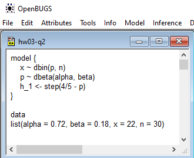
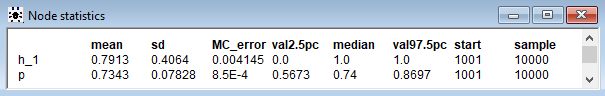

```{r setup, include=F, cache=F}
knitr::opts_knit$set(root.dir = here::here())
knitr::opts_chunk$set(
  # rows.print = 25,
  # rows.print = 25,
  echo = TRUE,
  # cache = FALSE,
  cache = TRUE,
  include = TRUE,
  fig.show = "asis",
  fig.align = "center",
  fig.width = 8,
  # size = "small",
  fig.height = 5,
  # fig.width = 5,
  # out.width = 5,
  # fig.asp = 0.75,
  warning = FALSE,
  message = FALSE
)
```

```{r postprocess, include=F, echo=F, cache=F}
.path_sans_ext <- file.path('hws', 'hw02')
.path_rmd <- paste0(.path_sans_ext, '.Rmd')
# spelling::spell_check_files(.path_rmd)
```

```{r setup-1, include=F, echo=F, eval=T}
library(tidyverse)
format_num <- function(x, digits = 4) {
  fmt <- sprintf("%%.%df", digits)
  sprintf(fmt, x)
}
```

# 1. Estimating the Precision Parameter of a Rayleigh Distribution.

## Instructions

<instructions>
If two random variables $X$ and $Y$ are independent of each other and 
normally distributed with variances equal to $\sigma^2$, then 
the variable $R = \sqrt{X^2+Y^2}$ follows the Rayleigh distribution.
Parameterized with precision parameter $\xi = \frac{1}{\sigma^2}$, 
the Rayleigh random variable $R$ has a density
</instructions>

$$
\begin{array}{c}
f(r) = \xi r \text{ exp } \{ \frac{-\xi r^2}{2} \}, \quad r \geq 0, \xi > 0.
\end{array}
$$

<instructions>
An example of such random variable would be the distance of darts from the target center
in a dart-throwing game where the deviations in the two dimensions of the target plane are
independent and normally distributed.<br/>
(a) Assume that the prior on $\xi$ is exponential with the rate parameter $\lambda$.
Show that the posterior is gamma $\mathcal{Ga}(2, \lambda+\frac{r^2}{2})$.<br/>
(b) Assume that $R_1 = 3, R_2 = 4, R_3 = 2$, and $R_4 = 5$ are Rayleigh-distributed
random observations representing the distance of a dart from the center. Find the posterior
in this case for the same prior from (a), and give a Bayesian estimate of $\xi$. <br />
(c) For $\lambda = 1$, Numerically find 95% Credible Set for $\xi$. <br /> <br />
Hint: In (b) show that if $R_1, R_2, \dots, r_n$ are observed, and the prior on $\xi$ is exponential $\mathcal{E}(\lambda)$,
the the posterior is gamma $\mathcal{Ga}(n+1, \lambda+\frac{1}{2}\sum_{i=1}^{n} r_i^2)$.
</instructions>

## Response


### a

Since we know that the population is
distributed as $f(r) = \xi r e^{-(\xi r^2)/2}$, we
can say that the likelihood is

$$
\begin{array}{rcl}
\sum_{i=1}^{n} f(r_i)
& = & \xi r_1 e^{-\frac{1}{2} \xi r_1} + \ldots + \xi r_n e^{-\frac{1}{2} \xi r_n} \\
& \propto & \xi e^{-\frac{1}{2} \xi r_1} + \ldots + \xi e^{-\frac{1}{2} \xi r_n} \\
& \propto & \xi e^{-\frac{1}{2}\xi \sum_{i=1}^n r^2}.
\end{array}
$$


Given that the prior $\pi(\lambda) = \lambda e^{-\lambda}$ (because it follows the distribution $\mathcal{Exp}(\lambda)$), we deduce that the
posterior is

$$
\begin{array}{rcl}
\text{ posterior }  & = & \text{ likelihood } \times \text{ prior } \\
& = & \xi^n \lambda e^{-\xi(\lambda + \frac{1}{2} \sum_{i=1}^n r_i^2)} \\
& \propto & \xi^n  e^{-\xi(\lambda + \frac{1}{2} \sum_{i=1}^n r_i^2)}
\end{array}
$$

The above expression is the kernel for the distribution $\mathcal{Ga}(n+1, \lambda+\frac{1}{2}\sum_{i=1}^{n} r_i^2)$.
(This is what is indicated by the hint).

<response>
Then, for the case of $n=1$, we see that $\mathcal{Ga}(2, \lambda+\frac{1}{2} r^2)$.
</response>

### b

Using the general form of the posterior shown above with 
$n=4$ and $\sum_{i=1}^{n} r_i^2 = 3^2 + 4^2 + 2^2 + 5^2) = 54$, 
<response>
we find that the posterior is
</response>
$$
\begin{array}{c}
\mathcal{Ga}((4)+1, \lambda+\frac{1}{2}(54)) = \mathcal{Ga}(5, \lambda + 27).
\end{array}
$$

The Bayesian estimate of $\xi$ is simply the expected value of the parameter under the posterior distribution.

We note that if $X \sim \mathcal{Ga}(\alpha, \beta)$, then

$$
\begin{array}{c}
\operatorname{E}(X) = \frac{\alpha}{\beta}.
\end{array}
$$

Thus, given that $\xi \sim \mathcal{Ga}(5, \lambda + 27)$, we find that

$$
\begin{array}{c}
\xi_{Bayes} = \operatorname{E}(\xi) = \frac{5}{\lambda + 27}.
\end{array}
$$

### c

The equitailed credible set $C$ is based on the posterior distribution.
This means that the set $C = [L, U]$ contains the true
parameter $1-\alpha$ probability.
Here, the parameter is $\xi$ and $\alpha=0.05$.

Formally, an equitailed credible set is calculated as follows.

$$
\begin{array}{c}
\int_{-\infty}^{L} \pi(p|x) dp \leq \frac{\alpha}{2}, 
\int_{U}^{+\infty} \pi(p|x) dp \leq \frac{\alpha}{2} \\
\text{ s.t. }
\Pr(p \in \left[L, U\right] | X) \geq 1 - \alpha
\end{array}
$$

We can calculate the 95% equitailed credibe set in `R` (given $\lambda = 1$) as follows.

```{r hw03-q1-c-1, include=T, echo=T, eval=T}
compute_equi_credible_set <- function(alpha, beta, level = 0.95) {
  q_buffer <- (1 - level) / 2
  q_l <- (1 - level) - q_buffer
  q_u <- level + q_buffer
  res <-
    c(
      l = qbeta(q_l, shape1 = alpha, shape2 = beta),
      u = qbeta(q_u, shape1 = alpha, shape2 = beta)
    )
}
alpha_1 <- 5
lambda_1 <- 1
beta_1 <- lambda_1 + 27
credible_set_1 <- compute_equi_credible_set(alpha_1, beta_1)
credible_set_1
```

```{r hw03-q1-c-2, include=F, echo=F, eval=T}
credible_set_chr_1 <- format_num(credible_set_1)
credible_set_chr_1
```

<response>
We find that the 95% credible set is [`r credible_set_chr_1[1]`, `r credible_set_chr_1[2]`)].
</response>


# 2. Estimating Chemotherapy Response Rates

## Instructions

<instructions>
An oncologist believes that 90% of cancer patients will respond to a new chemotherapy treatment 
and that it is unlikely that this proportion will be below 80%. 
Elicit a beta prior on proportion that models the oncologist’s beliefs.<br/><br/>
Hint: For elicitation of the prior use $\mu = 0.9, \mu − 2 \sigma = 0.8$ 
and expressions for $\mu$ and $\sigma$. for beta.<br/><br/>
During the trial, in 30 patients treated, 22 responded. <br/>
(a) What are the likelihood and posterior distributions? What is the Bayes estimator of the proportion?<br/>
(b) Using Octave, R, or Python, fine 95% Credible Set for $p$. <br/>
(c) Using Octave, R, or Python, test the hypothesis $H_0 : p \geq 2/3$ against the alternative $H_1 : p < 2/3$. <br/>
(d) Using WinBUGS, find the Bayes estimator, Credible Set and test, and compare results
with (a-c).
</instructions>

<hide>
(a)
likelihood -> 2018s-hw03-q2-a, ~2018s-hw03-q1-a
posterior ->  2018f-hw03-q1-iii, ~2018s-hw03-q1-a, ~2018s-hw03-q2-b
Bayes -> 2018f-hw03-q1-iii
(b) -> 2018f-hw03-q1-iii, 2018s-hw03-q2-c
(c) -> ~2018s-hw03-q1-c
(d) -> 2018f-hw03-q1-iii, ~2018s-hw03-q1-d, 2018s-hw03-q2-d
</hide>

## Response

First, we elicit a Beta prior according to the instructions.

The expectation of a Beta distribution $\mathcal{Be}(\alpha, \beta)$
for some random variable $X$ is $\operatorname{E}[X] = \frac{\alpha}{\alpha+\beta}$.
Given $\mu = 0.9, \mu − 2 \sigma = 0.8$, 
we can use algebra (or "trial and error")
to find that $\alpha = 0.72, \beta = 0.25 \alpha = 0.18$.

We can verify that values with `R`.

```{r hw03-q2-a-1, include=T, echo=T, eval=T}
alpha_0 <- 0.72
beta_0 <- 0.18
compute_beta_mu <- function(alpha, beta) {
  alpha / (alpha + beta)
}
mu_0 <- compute_beta_mu(alpha_0, beta_0)
mu_0
```

### a

Given the problem statement, 
<response>
we deduce the likelihood follows a binomial $\mathcal{Bin}(n, p)$ distribution.
</response>

$$
\begin{array}{c}
X \sim \mathcal{Bin}(n, p) \\
f(x|p) = \left( \begin{array}{c} n \\ x \end{array} \right) p^{x} (1 - p)^{n-x}
\end{array}
$$

And, given $n=30$ patients, $x=22$ of whom responded, the likelihood is

$$
\begin{array}{c}
f(x|p) = \left( \begin{array}{c} 30 \\ 22 \end{array} \right) p^{22} (1 - p)^{8}.
\end{array}
$$


The posterior distribution $\pi (p | x)$
is proportional to the product of the likelihood $f(x|p)$
and the prior distribution $\pi(p)$.

$$
\begin{array}{lcl}
\pi(p | x) & \propto & f(x | p) \pi(p) \\
& \propto & p^{x}(1-p)^{n-x}
\end{array}
$$

Next, we note that the general form the Beta distribution is

$$
\begin{array}{c}
X \sim \mathcal{Be}(\alpha, \beta) \\
f(x)=\frac{1}{\operatorname{B}(\alpha,\beta)} x^{\alpha - 1} (1-x)^{\beta-1}
\end{array}
$$

where $0 \leq x \leq 1, \alpha, \beta > 0$, $\operatorname{B}(\alpha,\beta) = \frac{\Gamma(\alpha) \Gamma(\beta)}{\Gamma(\alpha + \beta)}$ and $\Gamma(\alpha) = \int_{0}^{\infty} t^{\alpha-1} e^{-t} dt$.

We can re-structure the posterior distribution
to look like the general Beta distribution.

$$
\begin{array}{lcl}
\pi(p | x) & \propto & p^{x}(1-p)^{n-x} \\
& = & p^{(x+1)-1} (1-p)^{(n-x+1)-1}.
\end{array}
$$


Then, defining $\alpha ^\prime = x + 1, \beta ^\prime = n - x + 1$,
<response>
we write the posterior distribution as
</response>

$$
\begin{array}{lcl}
\pi(p|x) & \sim & \mathcal{Be}(\alpha ^\prime, \beta ^\prime) \\
& \sim & \mathcal{Be}(x + 1, n - x + 1).
\end{array}
$$


Finally, given $n=30,x=22$,
<response>
we find that 
the posterior distribution
</response>

$$
\begin{array}{lcl}
\mathcal{Be}(x + 1, n - x +1) & = & \mathcal{Be}(22 + 1, 30 - 22 + 1) \\
& = & \mathcal{Be}(23, 9).
\end{array}
$$

The Bayes estimator of the proportion $p_{Bayes}$ is simply the expected value 
of the parameter under the posterior distribution.

We note that if $X \sim \mathcal{Be}(\alpha, \beta)$, then

$$
\begin{array}{c}
\operatorname{E}(X) = \frac{\alpha}{\alpha+\beta}.
\end{array}
$$

<response>
Thus, we find that
</response>

$$
\begin{array}{lcl}
p_{Bayes} = \operatorname{E}(X) 
& = & \frac{(23)}{(23)+(9)} \\
& = & \frac{23}{32} \\
& = & 0.71875.
\end{array}
$$

We can verify the posterior mean $\mu_1$ using `R`.

```{r hw03-q2-a-2, include=T, echo=T, eval=T}
n <- 30
x <- 22
alpha_1 <- x + 1
beta_1 <- n - x + 1
mu_1 <- compute_beta_mu(alpha_1, beta_1)
mu_1
```

### b

We can calculate the 95% credible set using `R`
(using the function created in 1(c)).

```{r hw03-q2-b-1, include=T, echo=T, eval=T}
credible_set_1 <- compute_equi_credible_set(alpha_1, beta_1)
credible_set_1
```

```{r hw03-q2-b-2, include=F, echo=F, eval=T}
credible_set_chr_1 <- format_num(credible_set_1)
credible_set_chr_1
```

<response>
We find that the 95% credible set is [`r credible_set_chr_1[1]`, `r credible_set_chr_1[2]`].
</response>

### c

```{r hw03-q2-c-0, include=F, echo=F, eval=F}
# 2018f-hw03-q2-a
pbeta(0.75, 137, 65) # `betacdf(3/4,137,65)` in Matlab
# 2018f-hw03-q2-b
qbeta(0.025, 137, 65) # `betainv(0.025,137,65)` in Matlab
qbeta(0.975, 137, 65) # `betainv(0.975,137,65)` in Matlab
```

To test the null hypothesis $H_0 : p \geq 2/3$ against the alternative $H_1 : p < 2/3$,
let's calculate the posterior probability of the alternative first (using `R`).

```{r hw03-q2-c-1, include=T, echo=T, eval=T}
p_h1 <- 2 / 3
p_h1 <- pbeta(p_h1, alpha_1, beta_1, lower.tail = TRUE)
p_h1
```

```{r hw03-q2-c-2, include=F, echo=F, eval=T}
p_h1_chr <- format_num(p_h1, 4)
p_h1_chr
p_h0 <- 1 - p_h1
p_h0_chr <- format_num(p_h0, 4)
p_h0_chr
```

Analytically, the calculation for $\Pr(H_1)$ looks as follows.

$$
\begin{array}{lcl}
\Pr(H_1 : p < 2/3) & = & \int_{0}^{2/3} \mathcal{Be}(23, 9) dp \\
& = & \frac{\Gamma(23 + 9)}{\Gamma(23) \Gamma(9)} \int_{0}^{2/3} p^{23-1}(1-p)^{9-1} dp \\
& = & \frac{\Gamma(34)}{\Gamma(23) \Gamma(9)} \int_{0}^{2/3} p^{22}(1-p)^{10} dp \\
& \approx & `r p_h1_chr`.
\end{array}
$$

Then we find that the probability of the null hypothesis is 

$$
\begin{array}{c}
\Pr(H_0 : p \geq 2/3) = 1 - \Pr(H_1 : p < 2/3) = `r p_h0_chr`.
\end{array}
$$

<response>
Since we find that the null hypothesis has
a probability greater than 0.5,
we do not reject the null hypothesis (and, instead, reject the alternative hypothesis).
</response>

Note that Bayesian hypothesis testing is different than Frequentist hypothesis
testing. Vidakovic explains in [***Engineering Biostatistics***](http://statbook.gatech.edu/statb4.pdf).

> "In frequentist tests, it was customary to formulate $H_0$ as $H_0 : \theta = 0$ versus $H_1 : \theta > 0$ instead of $H_0 : \theta \leq 0$ versus $H_1 : \theta > 0$, as one might expect. The reason was that we calculated the p-value under the assumption that $H_0$ is true, and this is why a precise null hypothesis was needed.<br/> <br />"Bayesian testing is conceptually straightforward: The hypothesis with a higher posterior probability is favored. There is nothing special about the "null" hypothesis, and for a Bayesian, $H_0$ and $H_1$ are interchangeable."

### d

Below is OpenBUGS code to evaluate each of the results found above.



Note the following about the implementation in OpenBUGS.

+ Initial values were generated via "gen inits";
+ 1,000 burn-in samples were used;
+ 10,000 samples were used for estimation.

The output is shown below.



The Bayes estimator corresponds to the mean of `p`, which is 0.7352.
This is very close to the value that we found analytically---`r mu_1`.

The 95% credible set corresponds to the 2.5% and 97.5% values for `p`, which
are 0.5693 and 0.8719 respectively.
These values are reasonably close to the values we found with `R`--`r credible_set_chr_1[1]` and `r credible_set_chr_1[2]`.

The probability of the alternative hypothesis $H_1$ corresponds to the
mean of the `h_1` variable---0.1885. This is relatively close to the
value that we found with `R`---`r p_h1_chr`.

### Aside

We can use the `R` package `{R2OpenBUGS}` to achieve the same results
found directly in OpenBUGS.

```{r hw03-q2-1, include=T, echo=T, eval=F}
model <- function() {
  x ~ dbin(p, n)
	p ~ dbeta(alpha, beta)
	h_1 <- step(2/3 - p)
}
data <- list(alpha = 0.72, beta = 0.18, x = 22, n = 30)
inits <- NULL
params <- c('h_1', 'p')
res_sim <-
  R2OpenBUGS::bugs(
    data = data,
    inits = inits,
    model.file = model,
    parameters.to.save = params,
    DIC = FALSE,
    n.chains = 1,
    n.iter = 10000,
    n.burnin = 1000
  )
res_sim$summary
```

```{r hw03-q2-1-hide, include=F, echo=F, eval=F}
clipr::write_clip(knitr::kable(res_sim$summary))
```

|    |      mean|        sd|      2.5%|    25%|  50%|   75%|  97.5%|
|:---|---------:|---------:|---------:|------:|----:|-----:|------:|
|h_1 | 0.1955556| 0.3966498| 0.0000000| 0.0000| 0.00| 0.000| 1.0000|
|p   | 0.7343966| 0.0781395| 0.5678975| 0.6837| 0.74| 0.791| 0.8697|


